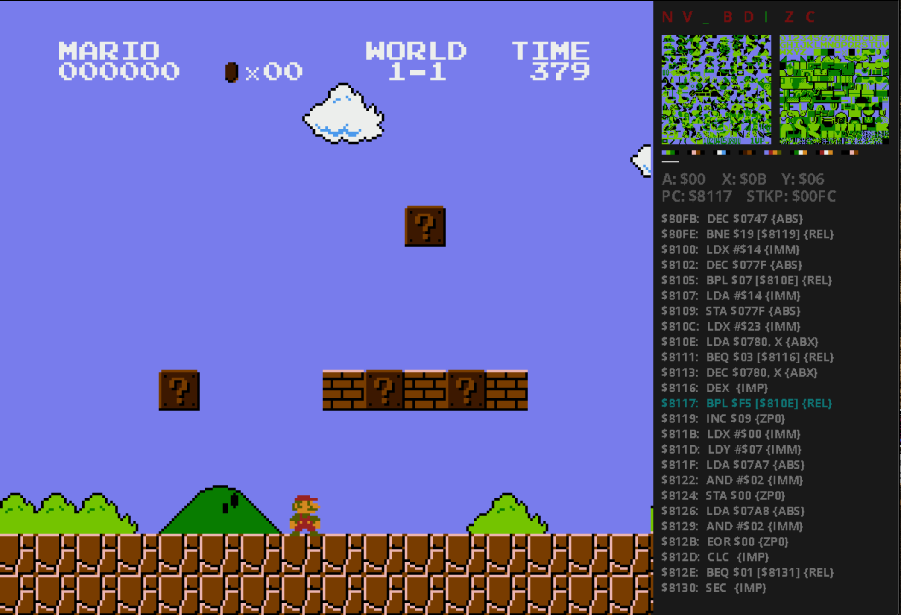

# nes

Another NES emulator

## Installing

Clone the repository. Change directory to root folder and create the binary using

```sh
make
```

To create a debug build, run

```sh
make debug-build
```

## Docs

After creating the binary from source run `./nes` to see the help menu. Run `./nes <filename.nes>` to start the emulator and run the NES game.

## Examples

Some screenshots




## Authors

- [Trung Truong](https://github.com/ttrung149)

## Special thanks

This project cannot be completed without these references. Thank you so much for putting these out there :)

- [6502 Reference](http://www.obelisk.me.uk/6502/reference.html)
- [Nesdev Wiki](http://wiki.nesdev.com/w/index.php/Nesdev_Wiki)
- [Good old OLC](https://github.com/OneLoneCoder)

## License

This project is licensed under the MIT License - see the [LICENSE.txt](LICENSE.txt) file for details
